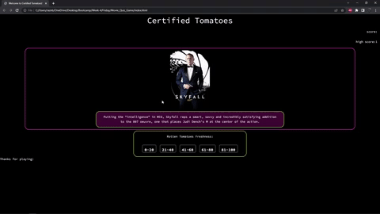

## Certified Tomatoes Quiz Game

## User Story
```
AS a user I wish to test my knowledge of movie ratings
WHEN I launch the game I am presented with a random movie poster and review
THEN I must guess what range the movie's Rotten Tomato rating falls in
IF I am correct I continue playing the game and my score increases by 1
WHEN I am incorrect the game finishes and I must restart to try and get a new highscore
```

## Description of our game
We decided to build a game that pulled data from IMDB's multiple APIs. We first generated a random movie out of their "top 250 box office API" and pulled that movie's ID that is unique to IMDB (ex. TT123456789) we then used that same ID to pull from different APIs and grab a movie poster and a movie review and display those on the screen. Behind the scenes we are also grabbing that same movies Rotten Tomatoes score to have the user try and guess what range the movie's "freshness" falls in (0-20, 21-40, 41-60, 61-80, or 81-100). If the user guesses correctly, they are allowed to continue playing. They will also be congratulated if they are correct and our GIPHY API will display a random GIF that either cheers the user on or celebrates them getting a question correct! However, if they are incorrect a "Game Over" GIF will pop up and the user will have to restart the game. The game functions on a "High Score" which is unique and stored locally to each user and for each question the user gets right they will get +1 score. 

## Languages used
This game was made using HTML, CSS, (with a tiny bit of help from the Skeleton CSS framework) JavaScript, and JQuery.

## Meet the developers
This game was developed by the following users. Please check out some of their other work below via their Github links!

* Mustafa Aboghalyoun - https://github.com/KappaMustafa
* Andy Bjerk - https://github.com/savoryboi
* James Buchmann - https://github.com/jbuck123
* Brandon Langer - https://github.com/Minotaurius

## Demo of game


## Deployed link to game
Click [HERE](https://minotaurius.github.io/Certified_Tomatoes/) to play our game! 

## Link to Repository storing application
* https://github.com/Minotaurius/Certified_Tomatoes